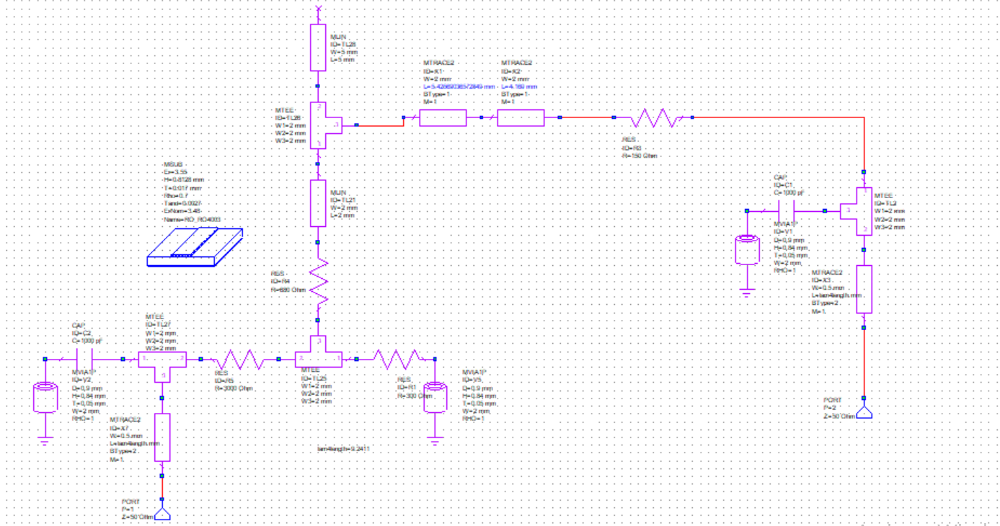
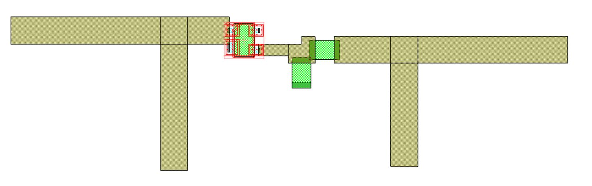
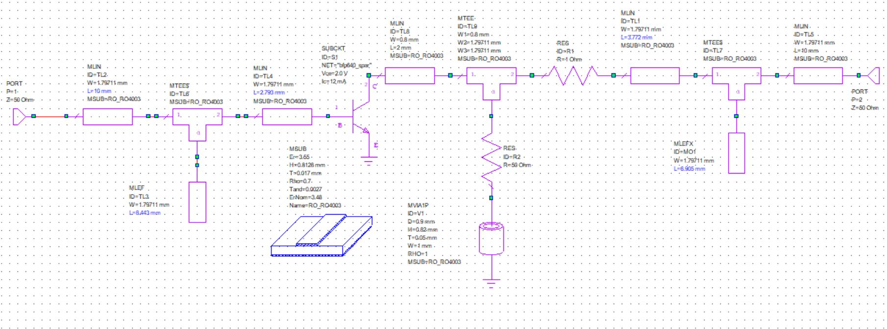
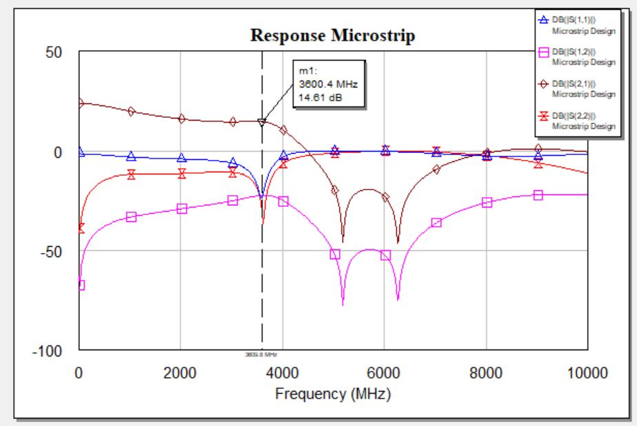
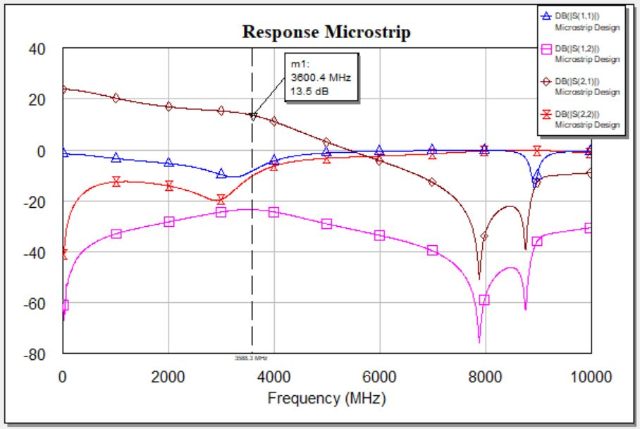
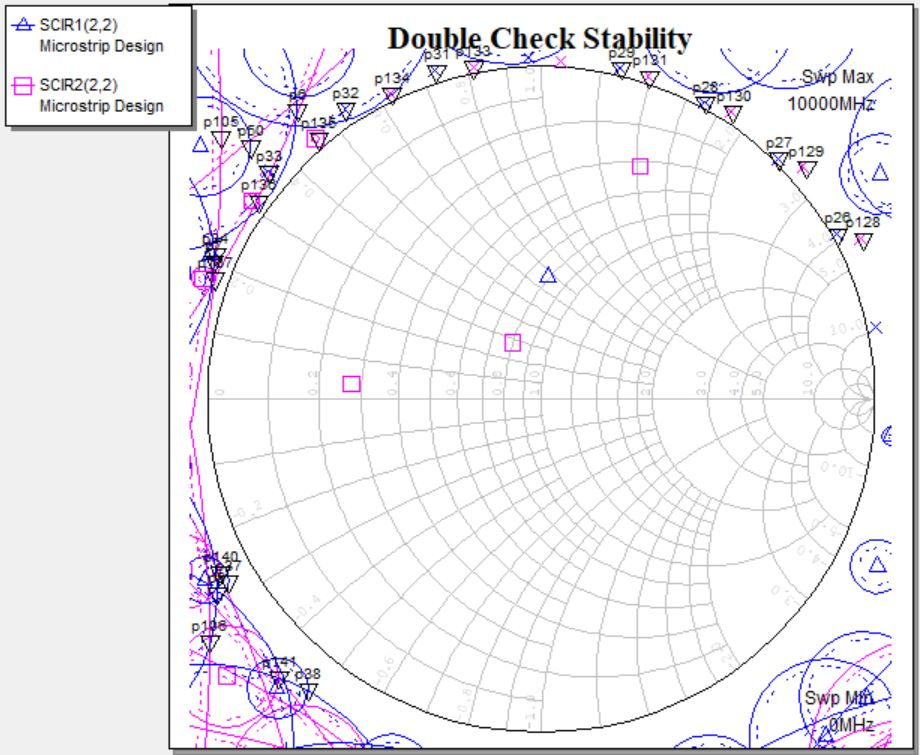
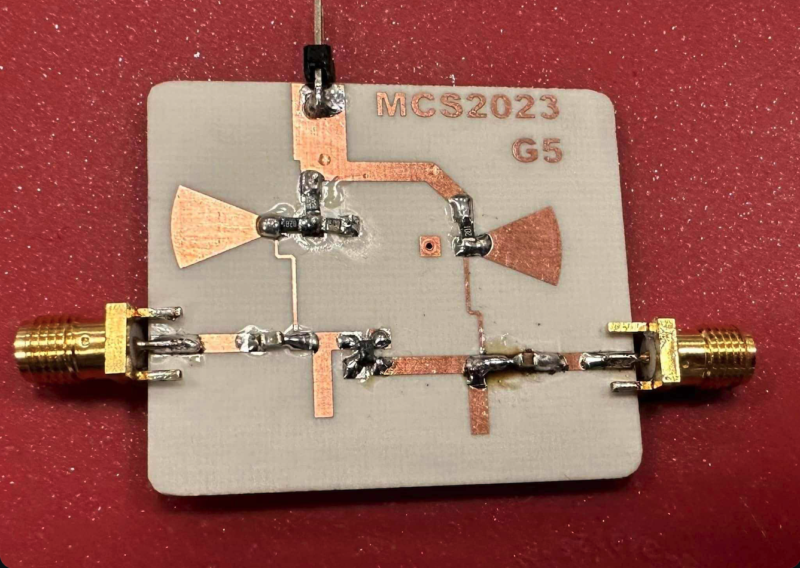
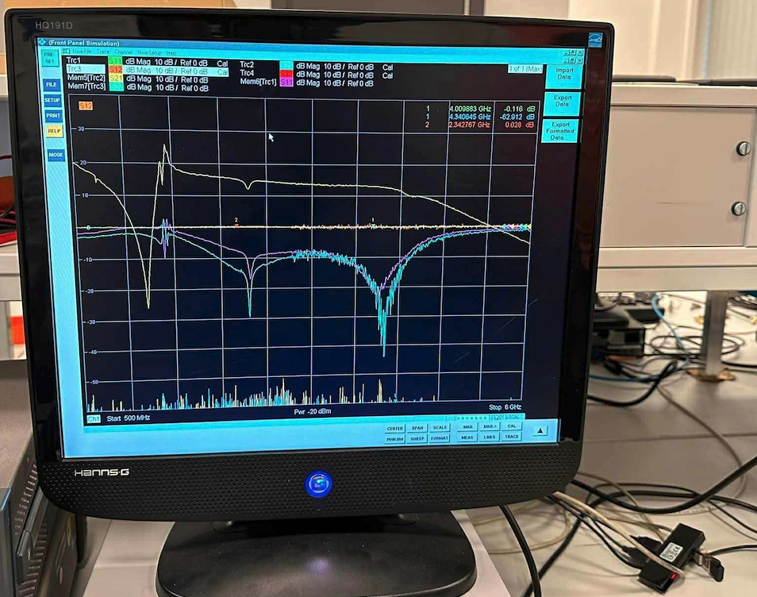

# Low Noise Amplifier (LNA) Design — 4.5 GHz | AWR Microwave Office

This repository presents my **M.Sc. Microwave Circuits and Systems** project,  
developing a **Low-Noise Amplifier (LNA)** at **4.5 GHz** using **NI AWR Microwave Office**.  
The project focuses on achieving **maximum transducer gain**, **unconditional stability**, and **microstrip implementation** on Rogers RO4003C.

---

## 🎯 Project Overview

- **Objective:** Design and implement a stable low-noise amplifier around the **BFP620F** transistor with maximum transducer gain.  
- **Technology:** Microstrip line design using **Rogers RO4003C** substrate (32 mil).  
- **Simulation Tool:** **NI AWR Microwave Office**.  
- **Measured Frequency:** 4.5 GHz.  
- **Achieved Gain:** ≈ 13.3 dB (stable).  
- **Bias Point:** VCE = 2 V, IC = 15 mA.

---

## ⚙️ Design Flow

1. **Specification Definition** — Bias point, transistor selection (BFP620F), substrate choice.  
2. **S-Parameter Analysis** — Extract S11, S12, S21, S22 at 4.5 GHz.  
3. **Stability Verification** — Ensure unconditioned stability (K > 1).  
4. **Matching Network Design** — Lumped-element networks (input & output).  
5. **Transmission-Line Replacement** — Convert ideal elements to microstrip (MLIN/MLEF).  
6. **Biasing Network** — Design DC biasing for BFP620F (VCE = 2 V, IC = 15 mA).  
7. **Simulation** — Verify gain, return loss, and stability in AWR.  
8. **Fabrication & Lab Testing** — Implement PCB, measure gain and compare results.

---

## 📐 Key Equations

\[
Γ_S = \frac{B_1 ± \sqrt{B_1^2 - 4|C_1|^2}}{2C_1}, \quad
Γ_L = \frac{B_2 ± \sqrt{B_2^2 - 4|C_2|^2}}{2C_2}
\]

\[
G_T = G_S + G_0 + G_L, \quad
G_T^{max} = 13.77 \text{dB}
\]

Gain stages:
- \( G_S = 1/(1 - |Γ_S|^2) \)  
- \( G_0 = |S_{21}|^2 \)  
- \( G_L = (1 - |Γ_L|^2)/|1 - S_{22}Γ_L|^2 \)

---

## 📊 Design Data

| Parameter | Value / Result |
|------------|----------------|
| Transistor | Infineon BFP620F |
| Substrate | Rogers RO4003C (εr = 3.55, h = 32 mil) |
| Frequency | 4.5 GHz |
| Gain (Simulated) | 13.33 dB |
| Stability (μ-test) | μ = 1.035 > 1 → Stable |
| DC Bias | VCE = 2 V, IC = 15 mA |
| PCB Housing | 0805 passives |

---

## 🖼 Gallery

### Simulation and Layout
| AWR Schematic | Microstrip Layout |
|----------------|------------------|
|  |  |

### Simulation Responses
| Response (Initial) | Response (After Tuning) | T-Junction Response |
|--------------------|--------------------------|---------------------|
|  |  |  |

### Stability and Noise Analysis
| Stability Check | Noise Figure |
|-----------------|---------------|
|  |  |

### Fabrication and Measurement
| Fabricated PCB | Lab Measurement Setup |
|----------------|------------------------|
|  |  |

## 🧩 Folder Structure

